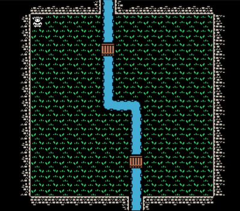

# Development Diary, July 28, 2019

This is the end of the first week of development of this Capstone project, tentatively titled "Capstone!" The Github Repo for this project can be found here: https://github.com/profounddark/capstone. The most recent build of the app can be found on the corresponding Github Pages site for the repo, found here: https://profounddark.games/capstone/.

An image of the project at the time fo the writing of this entry:



## Timeline
---
According to the project timeline, the first week was dedicated to building the initial pages for the app and initial testing of the Canvas element in **HTML**. Portions of the project timeline are recreated below:

| Project Tasks/Milestones | Time Estimate | Due Date |
| --- | :---: | :---: |
| Build Initial Pages/Views | 3d | |
| Initial Canvas testing |  4d-7d | 07/28/2019 |
| Implement tilemap in Canvas | 7d-3d | 08/04/2019 |
| Add controls, game function | 4d | |
| Complete basic game loop | 3d | 08/11/2019 |

In the first week, I prioritized the testing and implementation of Canvas over the development of the initial pages. My thought was that getting the basic graphics system down was a bigger step than a start and end game screen. In addition, I added basic game controls for moving the character around the playfield and basic collision detection.

## Page/View Development
---
No work was done on developing the start, end game, and high score screens during this week.

## Initial Canvas Testing and Implementing the Tilemap
---
It did not take long for me to get a very basic handle on how the Canvas element works in the 2D context and how to paint a basic map using tiled graphics. I created a small tilesheet (based on a larger tilesheet from Kenney's website at https://kenney.nl/) with the intent that I would add more tiles as necessary. Note that this tilesheet is only being used for the map; the player character and other "creatures" would be featured in another tilesheet.


One issue I faced in the initial phases was dealing with the size of the canvas; I had some concerns with regard to responsive design and the size of the canvas. A canvas element is declared (in HTML) with a specific size (typically understood to be pixels). With no other styling, the canvas will appear in the DOM in that size in pixels.
```
    <canvas id="gamemap" width="240" height="240"></canvas>
```
Have an element fixed in size in the HTML creates a distinct problem with respect to responsive web design and mobile users. If I create a canvas that is reasonably sized for mobile, it will be very tiny on desktops. As luck would have it, this was an easy fix. Although the size given in the HTML determined the size of the canvas for purposes of painting images, the size as it appears in the browser window could be reconfigured using CSS sizing. Thus, the following CSS helps size the viewing window appropriately across multiple platforms while maintaining the internal dimensions at the original 240x240 (for purposes of painting images).
```
canvas
{
    width: 100%;
}
@media screen and (min-width: 640px)
{
    canvas
    {
        width: 640px;
    }
}
```
It should be noted that at this time, the canvas either fills the width of the display (on screens smaller than 640px) or it takes up 640px (on screens at 640px or larger). I intend to adjust this styling later, once more of the game interface has been constructed.

## Adding Game Controls
---
With the tilemap displaying correctly, the next step I took was to add a player character and code to move the character around. I realized that per the design document, there should be two ways to move the character around the screen: the keyboard (for desktop players) and an on-screen control (for mobile users). I made a deliberate decision to implement keyboard controls first as it seemed the more straightforward option.

Keyboard control is done using the *keydown* event attached to the document. When the *keydown* event fires, it checks to see if any of the keys associated with movement are pressed. I provided two options for this: the arrow keys and WASD. This was handled accordingly:
```
document.addEventListener("keydown", event =>{
    console.log(event.key);
    if (event.key == "ArrowUp" || event.key == "w")
    {
        event.preventDefault();
        moveHero(currentGame.theHero, "UP");
    }
    else if (event.key == "ArrowDown" || event.key == "s")
    {
        event.preventDefault();
        moveHero(currentGame.theHero, "DOWN");
    }
    else if (event.key == "ArrowRight" || event.key == "d")
    {
        event.preventDefault();
        moveHero(currentGame.theHero, "RIGHT");
    }
    else if (event.key == "ArrowLeft" || event.key == "a")
    {
        event.preventDefault();
        moveHero(currentGame.theHero, "LEFT");
    }
});
```
When it recognizes the associated key, it runs a specific function that updates the main character's position in the game, paints the character on the new space, and repaints the space that the character previously came from. The intent was to minimize whole repaints of the display, acknowledging that in the future I will likely go to whole repaints.

One game design element that I affirmed during this portion was that the main game loop would be centered around the player moving the character. After each move, the rest of the game would "take a turn." This simplified the conceptualization of the main game loop; instead of constantly updating different components, a single component (currently, the moveHero function but eventually a sort of main game controller) makes the game function.

## Basic Game Functions - Collision
---
After setting up the tilemap display and basic movement, it became apparent that the next obvious step would be to add basic collision routines. I considered two different ways to solve this: having a separate layer to the game map which expresses whether a space is solid; or defining certain tiles in the tilesheet as solid and others as not. I realized that it was probably the simplest (computationally) to do the latter. I rapidly implemented a quick solution:
```
        this.collisionMap = [true, true, false, false, false,
            false, false, false, false, false, false, false,
            false, false, false, false, true, true];
```
This array represented a series of boolean values. The nth element in the array corresponded to the nth tile in the tilesheet, indicating whether that tile was passable or not.


Thus, as indicated here, the first two tiles (0 and 1, correpsonding to grass and dirt tiles) are passable. The next fourteen tiles are impassible. The last two tiles (16 and 17, corresponding to bridges) are passible.

The following code, called every time the game tries to move the player character, checks to see if the space on the tilemap corresponds to a passible space.

```
    isPassible(x, y)
    {
        if ((x < 0) || (y < 0) || (x > this.columns) || (y > this.rows))
        {
            return false;
        }
        else
        {
            return this.collisionMap[this.getTile(x,y)];
        }
    }
```