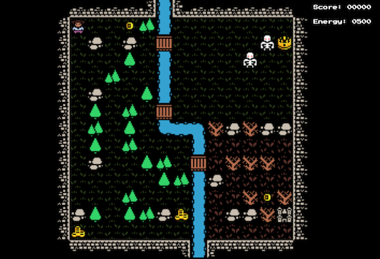
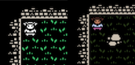

# Development Diary, August 4, 2019

This is the end of the second week of development of this Capstone project, tentatively titled "Capstone!" The Github Repo for this project can be found here: https://github.com/profounddark/capstone. The most recent build of the app can be found on the corresponding Github Pages site for the repo, found here: https://profounddark.games/capstone/.

An image of the project at the time fo the writing of this entry:



## Timeline
According to the project timeline, the second week was dedicated to implementing the tilemap graphics using the **HTML** Canvas element. Portions of the project timeline are recreated below:

| Project Tasks/Milestones | Time Estimate | Due Date |
| --- | :---: | :---: |
| Build Initial Pages/Views | 3d | |
| Initial Canvas testing |  4d-7d | 07/28/2019 |
| Implement tilemap in Canvas | 7d-3d | 08/04/2019 |
| Add controls, game function | 4d | |
| Complete basic game loop | 3d | 08/11/2019 |

The second week saw a continuation of the work I was doing in week one. Most of the game functions are working in a very basic capacity. The player can collect treasures on the map, their energy counts down with every step, and monsters can now be implemented with random movement.


## Page/View Development
No work was done on developing the start, end game, and high score screens during this week. However, having an end game screen has become a priority since I have created several events that reference (in comments) the firing of an "end game" event.

## Updating the Map

I made some significant changes to the map and added new tiles to the set of tiles. The new tilesheet includes new decorations and scenery in order to give some character to the map design. The expanded tileset includes trees, stumps and rocks. I also started recoloring some of the tiles in order to achieve a more unique "look" for my game.


In adding the new tiles, I also expanded the collision map array, as is illustrated below:
```
    this.collisionMap =
    [
        true,
        true, false, false, false, false,
        false, false, false, false, false,
        false, false, false, false, false,
        true, true, true, false, false,
        false, false];
```
As can be illustrated by the formatting of the array, I made it a bit easier to read. This was done because I was having some "user interface" issues myself in figuring out what was meant to be blocking terrain and what wasn't.

I gave a lot of thought to the idea of creating a new data class for terrain. To a certain extent, it seems like it could be interesting to have terrain stored as an array of Terrain objects, with methods that return important information like the image source, passibility, and so forth. If I ever get to the point there are different types of critters that move on different kinds of terrain (i.e., fish that swim in water and birds that fly over everything), I'll consider it.

## Adding New Critters

Originally, I had created a class for creatures and only used it for a single creature: the player. As I thought to add more "content" to the game, I decided to expand how I used the creature class and along with that expand the number of creatures. I also realized that I needed to change the way I was referring to them, so they became "critters" instead.


Other than adding several new critter tiles, I also updated them so they had transparent backgrounds (but were outlined in black). This allowed for part of the background tile to be visible while still ensuring that the character doesn't get lost.



The biggest change to the class is that it now tracks what kind of critter it is using a few custom methods. When a new critter is created, the type is specified in the constructor as text. This is then converted to an integer. In addition, the other variable passed sets a parameter of the critter (where appropriate):
```
    constructor(startX, startY, number, type, value)
    {
        this.posX = startX;
        this.posY = startY;
        this.imageNumber = number;
        switch (type.toUpperCase())
        {
        case 'PLAYER':
            this.cType = 0;
            break;
        case 'TREASURE':
            this.cType = 1;
            this.pointValue = value;
            break;
        case 'MONSTER':
            this.cType = 2;
            break;
        default:
            console.log('unknown type');
        }
        
    }
```
Another method returns what type of critter it is (as text). This way, I can iterate through an array of critters and take different actions based on what type of critter it is. For example, the TREASURE critters have only one operation each turn: check to see if the player critter is sharing the same space. If it is, schedule the critter for removal and add the appropriate number of points to the player's score.
```
    repaintTiles.push({x: currentLevel.critters[count].posX, y: currentLevel.critters[count].posY});
    killCritters.push(count);
    mainGame.updateScore(currentLevel.critters[count].pointValue);
```

One thing that is weird for me as somebody who comes from a typed language background is the idea that different types of critters will have a different structure to the object. All objects will have position data (posX and posY), an image number on the critter tilesheet, and a type. Critters of type TREASURE will also have an additional variable: the point value.

All of the critters are tracked in the array. Right now, I am proceeding under the notion that the critter in position 0 is ALWAYS the player. When I start to generalize level construction more, I intend for that to be a guideline in the construction of the critter array. Right now, it's organized in the order of:
* PLAYER critter in position 0.
* TREASURE critters immediately after the PLAYER critter.
* MONSTER critters immediately after the TREASURE critters.
Eventually, I may take advantage of this to minimize calculations, but I haven't gotten to that point yet.

Because critters are more general, the function has now been refactored a bit. Code pertaining to moving the critter and check for passibility of the destination square has become the generalized MoveCritter function. The other parts of the function were turned into a broader ProcessTurn function, which now goes through the list of critters and does game functions.

As an aside, currently the MONSTER critters move every other turn via random movement. I wanted something but had not decided exactly what that something would be. I expect to come back to it.

## Repainting Tiles instead of the Whole Screen

In testing, I tried a few different methods for painting (and repainting) the game screen. At the end of the first week, I did the big paint of the screen when the game starts and then only repainting individual tiles when the player moves. With more creatures and things moving about the map, I thought I would try something different and just repaint the whole map every time. Although still completely functional this ended up taking considerably longer (in milliseconds).
After giving it some thought, I actually went back to the previous method but with a little bit more sophistication. Now, through the processing of the turn, and tile from which a critters moves out of is added to an array called ```repaintTiles```. At the end of the processing of the turn, every tile in that array is repainted from the map. In addition, all of the tiles in the critter array are repainted.
```
    // this repaints the all of the tiles needed to be repainted
    repaintTiles.forEach(function(item){
        currentLevel.drawTile(item.x, item.y);
    });
    currentLevel.critters.forEach(function(element){
        currentLevel.drawCritter(element);
    });
```
This ensures that there are no sprite "shadows" on the map but also that all of the characters get appropriately painted on the game board. It's a bit fussier but actually saves a considerable amount of processing. That being said, I suspect that at some point I'll have to ditch it in favor of just repainting the whole map, especially when I get into something sophisticated like a scrolling map.

## Mobile Controls
A first pass at mobile controls has been implemented. The mobile control ```<div>``` does not display on desktop; it only appears when the ```min-width``` of the window is less than 640. There are four buttons, each corresponding to a direction. As is illustrated below, I hard-coded the JS function call to the ```processTurn()``` function. This is temporary; it's not my intent to keep that, but I wanted to get mobile play working now. Even the styling of the buttons is temporary.
```
    <button class="up" onmousedown="processTurn('N')">UP</button>
    <button class="left" onmousedown="processTurn('W')">LEFT</button>
    <button class="right" onmousedown="processTurn('E')">RIGHT</button>
    <button class="down" onmousedown="processTurn('S')">DOWN</button>
```
The buttons work, although they highlight an unexpected issue. Rapidly tapping the buttons, at least on iOS, initiates the accessibility zoom-in. For the purposes of playing a game, this is not a good feature, so I have had to begin researching how to disable this feature. I added an issue to the GitHub repo in order to keep track of it.

## Score and Energy Trackers

As I had now added a lot of the elements of the game, including treasure and monsters, it seemed appropriate to add the on-screen trackers for score and player energy. After a few stabs at this, I eventually went with a new data structure for the game called gameState. Now, the map data (with critters and whatnot) is data for the specific level while the overall game data is tracked in gameState. Right now, that's mostly just score and energy (which, in my conception of the game, would pass from level to level).

This also featured the first end state for the game: the player runs out of energy!
```

    updateEnergy(amount = -1)
    {
        this.playerEnergy = this.playerEnergy + amount;
        let energyStr = this.playerEnergy.toString();
        this.energyTracker.innerHTML = energyStr.padStart(4, '0');
        if (this.playerEnergy == 0)
        {
            console.log('throw end of game event');
        }
    }
```
Of course, as can be seen here, it doesn't actually do anything yet. Eventually, my plan is for "running out of energy" to be the actual game end. Monsters will just consume player energy faster than the normal rate (thus, creating an appropriate amount of danger).