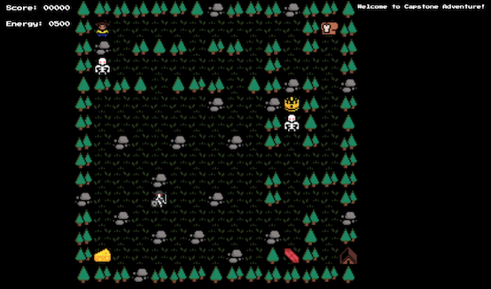

# Development Diary, August 11, 2019

This is the end of the first week of development of this Capstone project, tentatively titled "Capstone!" The Github Repo for this project can be found here: https://github.com/profounddark/capstone. The most recent build of the app can be found on the corresponding Github Pages site for the repo, found here: https://profounddark.games/capstone/.

An image of the project at the time fo the writing of this entry:



## Timeline
According to the project timeline, the first week was dedicated to building the initial pages for the app and initial testing of the Canvas element in **HTML**. Portions of the project timeline are recreated below:

| Project Tasks/Milestones | Time Estimate | Due Date |
| --- | :---: | :---: |
| Implement tilemap in Canvas | 7d-3d | 08/04/2019 |
| Add controls, game function | 4d | |
| Complete basic game loop | 3d | 08/11/2019 |
| Add Firebase functionality, high score saving | 7d | 08/18/2019 |

The first two weeks were spent understanding how Canvas works and implementing basic gameplay. A significant portion of the work this week was refactoring, modularizing the code, adding new basic features, and other gameplay refinements.

## JaveScript Modules
For the first two week, the entirety of hte JavaScript for the project was stored in a single .JS file. As the code had gotten sufficiently complex, this became a good time to start breaking code up into modules. The class for the critters (creatures and items that populate the board) was put into its own .JS file. The class for the level map was put into its own .JS file. For now, the remaining code is in the principle .JS file, ```main.js```.

This required a few changes to the way that JavaScript was being used. The major change was that the ```<script>``` element in the main **HTML** file had to have the additional tag of ```type="module"```.  This had the unexpected effect of rendering the JavaScript calls that I was making from ```index.html``` non-functional. This meant that I had to specifically add ```mousedown``` listeners to the four mobile friendly control buttons via JavaScript. This wasn't that big a deal; it just required implementation.

## Expanding Classes
With the individual classes now relegated to separate .JS files, it became much more straightforward to expand them. The most notable expansion is with the ```Critter``` class, which is used to track all of the creatures on the board. This class was expanded out to include a variety of subclasses corresponding to different types of critters. I took advantage of the ability to overwrite functions to create different methods of movement for the different movable critters. Eventually, this resulted in two distinct ```Monster``` subclasses: ```TwoWayMonster``` and ```RandomMonster```. This really began to change the way certain parts of the code function. For example, elements that used to be handled in the main ```ProcessTurn``` function are now being handled by class methods without specific distinction. For example, when it comes time to move a *Monster* typed ```Critter```, the ```ProcessTurn``` function just runs ```critter.moveCritter(level)```, which results in different movement depending on which kind of Critter it is. The code snippets below illustrate the difference.

### Random Movement Monster method:
```
    moveCritter(level)
    {
        let numb = Math.floor(Math.random() * 4);
        switch (numb)
        {
            case 0: super.moveCritter(level, 'N'); break;
            case 1: super.moveCritter(level, 'E'); break;
            case 2: super.moveCritter(level, 'S'); break;
            case 3: super.moveCritter(level, 'W'); break;
        }
    }
```


### Two Way Movement Monster method:
```
    moveCritter(level)
    {
        let oldXY = this.XY;
        super.moveCritter(level, this.lastDir);
        if (this.XY == oldXY)
        {
            switch(this.lastDir)
            {
                case 'N': this.lastDir = 'S'; break;
                case 'E': this.lastDir = 'W'; break;
                case 'S': this.lastDir = 'N'; break;
                case 'W': this.lastDir = 'E'; break;
            }
            super.moveCritter(level, this.lastDir);
        }
    }
```

This expansion of the ```Critter``` class also included a new subclass, the ```Food``` class. ```Food``` and ```Treasure``` work very similarly but contribute to different parameters: **Energy** and **Points**, respectively. It seems relatively obvious that these two could likely be reduced to a single subclass that simply affect different game parameters. That is something that will be added later, when I get to more serious refactoring.

## Page/View Development
A basic start page was added that included a start button. 

One unique "bug" that developed from this was the fact that all of the movement control listeners were established either after the DOM loaded or in the main.js file itself. This meant that from the start screen the player could actually start "playing" the game (even though it was not visible). To remedy this, all of the code for adding event listeners for game inputs (both keyboard and mobile buttons) were moved to the ```mousedown``` event for the button.

Once I did that, it occurred to me that the level was still being loaded prior to the start button being pushed. To keep it consistent with the rest of the start button function, I moved the instancing of the level and the drawing of the map to the start button ```mousedown``` event as well.

## Adding JSON Map processing
Although I had originally intended for the implementation of JSON files to be an "after the end of the quarter" feature, it became obvious to me that this game would need a few levels to really showcase the variety of features and things that it could handle. Therefore, I grabbed some existing code from another project and re-worked it to load JSON level files. It is important to emphasize that this is very much still in "patched together until it works" status. I know that what I'm doing isn't particularly nice nor elegant. Down the road, I will do something more expansive.

## Updated Tilesheet
While developing a second level map, I also decided it would be a good time to re-work the tilemap. Both the terrain map and the critter map were redone to include new tiles, re-color existing tiles, and remove some tiles that were not working well. The resulting maps are featured below.

### The Updated Terrain Spritesheet:


### The Updated Critter Spritesheet:


## The Scrolling Information Box
One added feature not previously mentioned was the concept that a ```Monster``` can attack the ```Player``` if the monster starts its turn adjacent to the ```Player```. If this occurred, an appropriate amount would be deducted from the Energy parameter. However, there was the troubling notion that it was very difficult to even *notice* if such a thing happened. I wanted to add a feedback window that informed the player of things that happened. To that end, I created a new ```<div>``` that would be sent important information whenever it occurred. This included picking up points and/or food and taking damage.

Unfortunately, this addition pointed out the somewhat unreliable nature of the CSS currently in use. In desktop testing, the information box appears to the side and can often make the size of the gameplay window change unexpectedly. On mobile, the information box can either cause the mobile contrls to move unexpectedly or to make the game entirely unplayable. Although the idea is novel, it's obvious that more work is needed.