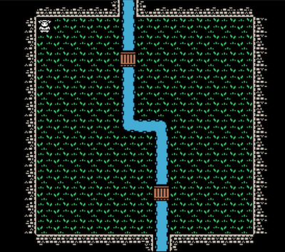

# Development Diary, August 11, 2019

This is the end of the first week of development of this Capstone project, tentatively titled "Capstone!" The Github Repo for this project can be found here: https://github.com/profounddark/capstone. The most recent build of the app can be found on the corresponding Github Pages site for the repo, found here: https://profounddark.games/capstone/.

An image of the project at the time fo the writing of this entry:




## Timeline
According to the project timeline, the first week was dedicated to building the initial pages for the app and initial testing of the Canvas element in **HTML**. Portions of the project timeline are recreated below:

| Project Tasks/Milestones | Time Estimate | Due Date |
| --- | :---: | :---: |
| Build Initial Pages/Views | 3d | |
| Initial Canvas testing |  4d-7d | 07/28/2019 |
| Implement tilemap in Canvas | 7d-3d | 08/04/2019 |
| Add controls, game function | 4d | |
| Complete basic game loop | 3d | 08/11/2019 |

In the first week, I prioritized the testing and implementation of Canvas over the development of the initial pages. My thought was that getting the basic graphics system down was a bigger step than a start and end game screen. In addition, I added basic game controls for moving the character around the playfield and basic collision detection.

## Page/View Development
A basic start page was added that included a start button. 

One unique "bug" that developed from this was the fact that all of the movement control listeners were established either after the DOM loaded or in the main.js file itself. This meant that from the start screen the player could actually start "playing" the game (even though it was not visible). To remedy this, all of the code for adding event listeners for game inputs (both keyboard and mobile buttons) were moved to the ```mousedown``` event for the button.

Once I did that, it occurred to me that the level was still being loaded prior to the start button being pushed. To keep it consistent with the rest of the start button function, I moved the instancing of the level and the drawing of the map to the start button ```mousedown``` event as well.

