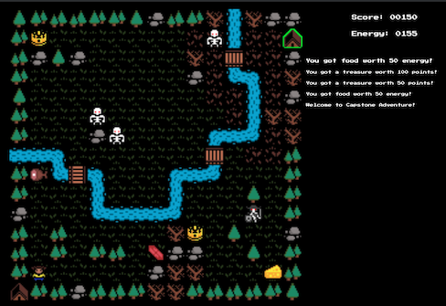

# Development Diary, August 18, 2019

This is the end of the fourth week of development of this Capstone project, tentatively titled "Capstone!" The Github Repo for this project can be found here: https://github.com/profounddark/capstone. The most recent build of the app can be found on the corresponding Github Pages site for the repo, found here: https://profounddark.games/capstone/.

An image of the project at the time fo the writing of this entry:



## Timeline
According to the project timeline, the fourth week was dedicated to implementing a high score saving system by implementing Firestore with Firebase. Portions of the project timeline are recreated below:

| Project Tasks/Milestones | Time Estimate | Due Date |
| --- | :---: | :---: |
| Complete basic game loop | 3d | 08/11/2019 |
| Add Firebase functionality, high score saving | 7d | 08/18/2019 |
| Additional adjustments, testing | 5d-4d | |
| Implement Analytics | 2d-3d | 08/25/2019 |

An important element of the game that had not been implemented yet was an end state. Specifically, the state at which the player runs out of energy. This was the number one priority for this week of development. I included game screens (Game Over and High Score) to support having an end state. Although I expected the Firebase implementation to be difficult, it was actually very straightforward.

## Adding a Game Over and High Score Screen

A "Game Over" screen was added to inform the player that they have ended the game and present them their high score. THis was relatively straightforward. A similar High Score screen was implemented, although it was initially little more than a placeholder. Both screens were "temporary" until the could be database was implemented.

## Adding an End State (Out of Energy)

This was a relatively easy implementation: any time that the ```GameState``` class tries to update energy, it checks to see if the player energy is equal to or below zero. If it does, it runs the end game.
```
    updateEnergy(amount = -1)
    {
        this.playerEnergy = this.playerEnergy + amount;
        let energyStr = this.playerEnergy.toString();
        this.energyTracker.innerHTML = energyStr.padStart(4, '0');
        if (this.playerEnergy <= 0)
        {
            this.endGame();
        }
    }

    endGame()
    {
        this.acceptInput = false;
        document.getElementById("finalpoints").innerHTML = this.playerScore;
        mainGame.switchScreens('levelscreen', 'gameoverscreen');
    }
```

Surprisingly enough, the "end game state" is little more than switching to the Game Over screen and setting the ```acceptInput``` variable to false. This variable prevents the game from accepting any additional game inputs.

## Loading High Scores from Firebase

I experimented with a few different ways to handle storing score data on Firebase, but I decided to go with a single collection (called ```highscores```) and a series of documents inside that collection which contains the basic structure of:
```
"playername": "Player's Name";
"score": 1550;
"timestamp": <timestamp data>;
```
Storing them as individual documents within the collection allowed me some flexibility that I had not considered when I started. When I want to update the High Score table on the **div** labelled *highscorescreen*, I use the following code:
```
function loadHighScores()
{
    collectionRef.orderBy("score", "desc").limit(10)
        .get()
        .then(function(collections)
        {
            scoreTable.innerHTML = "";
            collections.forEach(function(doc)
            {
                let newRow = document.createElement('tr');
                let newName = document.createElement('td');
                newName.innerText = doc.data().playername;
                newRow.appendChild(newName);
                let newScore = document.createElement('td');
                newScore.innerText = doc.data().score;
                newRow.appendChild(newScore);
                scoreTable.appendChild(newRow);
            });
        })
        .catch(function(error)
        {
            console.log("Error getting documents: ", error);
        });
}
```

In order to add a new high score, I first wrote a function that created a new document in the collection with the player's name, their score, and the current timestamp:
```
function addHighScore(newName, newScore)
{
    let newData = new Object();
    newData.playername = newName;
    newData.score = newScore;
    newData.timestamp = firebase.firestore.Timestamp.now();
    collectionRef.add(newData)
    .then(function(docRef){
        console.log("Document written with ID: ", docRef.id);
    })
    .catch(function(error){
        console.log("Error adding document: ", error);
    });
}
```

I added a text input box to the Game Over screen and created a new button to "Save Score." This button takes the input from the input box and sends it to the addHighScore function. [As an aside, this event listener also changes the default name in the input box to whatever is saved here.]
```
        document.getElementById('savebutton').addEventListener("mousedown", function(event)
        {
            let nameInput = document.getElementById('nameinput');
            let playerName = nameInput.value;
            nameInput.setAttribute('placeholder', playerName);
            addHighScore(playerName, mainGame.score);
            loadHighScores();
            let destPage = event.target.getAttribute('destination');
            let sourcePage = event.target.getAttribute('source');
            mainGame.switchScreens(sourcePage, destPage);
        });
```
The Firestore gets a new document representing that player's name, score, and timestamp.

## Minor CSS Tweaks and Changes

The screen arrangement in desktop mode has been reconfigured. The player's energy and score are display on the right, above the information output window. Output is still limited to ten items, although I have begun experimenting with this in order to find the right number of items such that it will scroll to the bottom of the canvas element.