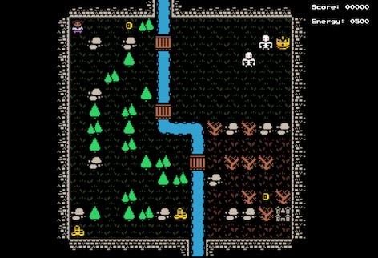

# Developer Diary for Capstone Adventure

## Introduction
As this project is being done over the course of six weeks as a "Capstone" to my Web Development program, I thought I'd start posting my experiences every week as a "developer diary." After the course ends, it'll probably be much less frequently than weekly, but I intend to do my best to keep it up.

## July 28, 2019 - The First Week of Development
This week saw the initial implementation of the program, primarily focused on displaying a basic game map and creating a way to move the player around the map. The full entry can be found [here](./part01.md).

Completed this week:
* Basic implementation of canvas to display tilemap.
* Basic player control/movement (desktop only).
* Basic collision detection with specific terrain types.

## August 4, 2019 - The Second Week of Development
This week saw a continuation of the previous week with a variety of new, exciting features. This release added mobile controls, score tracking, an expanded map, along with actual treasures and monsters to encounter. The full entry can be found [here](./part02.md).

Completed this week:
* Basic mobile player control/movement
* Additional tile types, expanded map
* Monsters and Treasures!
* Score and Energy tracking